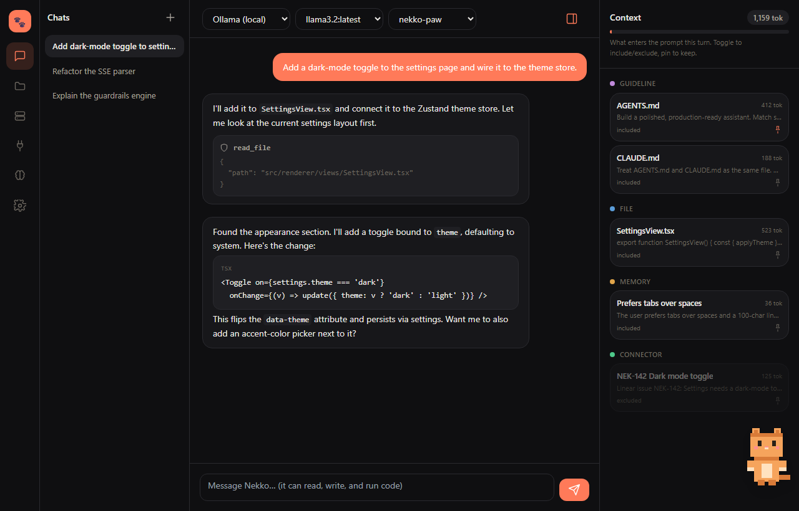

<div align="center">

# 🐾 Open Paw

**Local-first AI coding & cowork — chat, cowork, and code in one calm window.**

Open source · MIT · first-class support for the models you run yourself.

</div>

---

Open Paw is a desktop assistant (Electron + React) that unifies conversation and
coding into a single surface. Its headline feature is **first-class local model
support** — point it at Ollama, LM Studio, or vLLM in one click — alongside every
major cloud provider. It ships with a context-provenance inspector, default
guardrails for risky commands, an out-of-the-box sandbox, multi-folder code
indexing, memory management, connectors, and an 8-bit cat mascot that makes
biscuits while the model thinks.

> **Verified working** end-to-end against a live LM Studio server (`google/gemma-4-31b-qat`):
> connect, model listing, streaming, **reasoning models**, and the full tool-calling
> agent loop (single- and multi-step). Run `node scripts/itest-local.mjs <baseUrl> <model>`
> to check your own server.



<table>
  <tr>
    <td width="50%"></td>
    <td width="50%"></td>
  </tr>
</table>

> A full picture-by-picture tour is in the **[walkthrough guide](docs/WALKTHROUGH.md)**.

## Why Open Paw

**LM Studio runs models. Open Paw runs *with your work*.** Local model UIs are
essentially a chat box around a model — no awareness of your files or projects.
Nekko reads, edits, searches, and runs inside your actual codebases: multi-folder
index, file viewer with inline editing, a tool-using agent, per-project memory,
and guardrails. Same one-click local-model setup — but the model can do the work,
not just talk about it.

**The power of an agentic CLI, with eyes.** Terminal agents (Claude Code, aider, …)
are powerful but blind — you can't *see* what changed without `git diff`, and
editing means leaving the tool. Nekko gives an IDE-like surface: browse the indexed
tree, view files and diffs, edit inline, while the agent works alongside you — every
action visible through the Context Inspector and approval prompts.

## Editions

Same engine, same UI, multiple runtimes (see the design in the project spec):

| Edition | How | Status |
| --- | --- | --- |
| **Desktop** | Electron app / `npm run dev` | ✅ available |
| **Self-hosted web** | `npm run web` — offline, the same UI in your browser | ✅ available |
| **Docker** | `docker compose up` — workspaces as volumes, local models via `host.docker.internal` | ✅ available |
| **Nekko Cloud** (paid) | managed hosting: subscriptions, always-available **Zero-Data-Retention** mode, cloud chat-history + file management, and **drive your local model from your phone** via a secure E2E relay | 🔜 planned |

The desktop, web, and (coming) Docker editions all run the **same engine + same React UI** — only the transport differs (Electron IPC vs HTTP/WebSocket), via the shared `@open-paw/host`.

### Run the web edition

```bash
npm install
npm run web        # builds everything, then serves at http://localhost:4317
```

Same app, in your browser, fully offline. It binds to `localhost` by default; set
`OPENPAW_TOKEN` to require an access token (append `?token=…` to the URL) before
exposing it with `OPENPAW_HOST=0.0.0.0`. Data lives in `~/.open-paw` (override with
`OPENPAW_DATA_DIR`).


### Run with Docker

```bash
docker compose up        # build + run, then open http://localhost:4317
```

Mount your codebases into `./workspace` (the sandbox confines file tools there),
and reach a model server on your host at `http://host.docker.internal:<port>`.
Settings/sessions persist in the `nekko-data` volume. Published to the host's
localhost by default; set `OPENPAW_TOKEN` before exposing on a network.

Cloud keeps inference and tools **on your machine** — the relay is an
end-to-end-encrypted pipe to a paired local agent, so using your own model stays
private by design.

## Features

- **Unified chat / cowork / code** — one thread, no mode switching.
- **Local models, first-class** — auto-discover Ollama / LM Studio / vLLM; pull,
  load, and unload Ollama models; manage servers and watch token usage.
- **Cloud providers too** — Anthropic, OpenAI, OpenRouter, any OpenAI-compatible endpoint.
- **Context Inspector** — see exactly what enters the prompt (files, guidelines,
  memory, connectors) with live token counts; toggle and pin anything.
- **Guardrails** — risky commands (`rm -rf`, force push, `curl | sh`, …) prompt
  before running; configurable allow / ask / deny per rule.
- **Sandbox** — workspace-jail by default, optional Docker isolation, or ask-everything.
- **Multi-folder index** — add multiple roots; file + symbol index with fast search.
- **Memory** — global and per-project, stored as plain markdown.
- **Connectors** — Linear, Slack, Discord, Gmail, Google Drive.
- **Nekko the mascot** — peeks in from the edge, waves, and kneads cat biscuits.

## Architecture

npm-workspaces monorepo:

| Package | What |
| --- | --- |
| [`packages/shared`](packages/shared) | Types + IPC contracts (pure, no deps) |
| [`packages/core`](packages/core) | Engine: providers, agent loop, guardrails, context assembler, indexer, memory, connectors. Pure TS, unit-tested. |
| [`apps/desktop`](apps/desktop) | Electron app (main / preload / React renderer) |
| [`apps/website`](apps/website) | Static marketing site |

The core engine is Electron-free so it can be tested in isolation and reused.

## Develop

```bash
npm install
npm run build:core   # build shared + core
npm test             # vitest (guardrails, context, outline)
npm run dev          # launch the desktop app (electron-vite)
```

Build installers:

```bash
npm run dist         # electron-builder → apps/desktop/release
```

Releases are published to GitHub Releases by the [release workflow](.github/workflows/release.yml)
on `v*` tags. Download links on the [website](apps/website) point there.

## License

MIT © Nekko Labs
