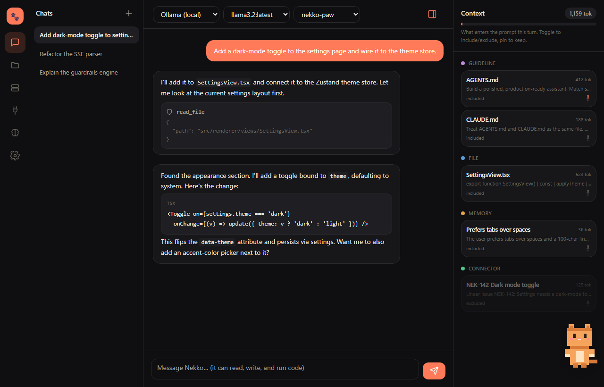

<div align="center">

# Agent Nekko

**AI help on your computer. For coding and everyday work.**

Free and open source · MIT licensed · AI on your computer or online

</div>

---

## Overview

Agent Nekko helps you write, code, and handle repetitive work. Use AI running
on your computer or connect an online AI service. You choose what Nekko can
access and review its work. A **model** is the AI you choose; **local** means
it runs on your own computer.

Use Nekko's desktop app or connect it to your existing tools through its
command-line interface (CLI) or the Model Context Protocol (MCP).

1. **Use AI on your computer or online.** Connect AI running through Ollama,
   LM Studio, or vLLM alongside online AI services. Use Nekko's app or compatible
   tools such as Claude Code, Cursor, Codex, and OpenClaw.
2. **Choose the right AI for the job.** Use a more capable model for difficult
   work and a smaller one for simpler tasks. Models running on your computer
   have no per-token API bill; hardware, electricity, and online services still
   have costs. Explicit cross-model delegation is in this unreleased source.
3. **Automate repetitive work.** Schedule tasks and save reusable workflows,
   with limits on retries and a visible history of what happened.
4. **Manage your AI models in one place.** Connect existing model servers and
   use supported controls to download, load, or unload models. Automatic setup
   of the software that runs them is planned, not available yet.
5. **Control your computer by voice (planned).** One guided setup
   chooses a compatible intent LLM, TTS, optional voice-input STT, and required
   runtimes by checking your hardware against minimum requirements. Control
   supported local apps and actions within permissions you choose, with
   sensitive-action confirmations and an immediate stop control. Initial
   downloads need a connection or a verified offline bundle; the intended
   control experience then works locally without cloud fallback. This complete
   setup and computer-control flow is not available yet.

Local-only sessions can work offline after their models and dependencies are
installed. Frontier calls and online integrations need a connection and send
selected context to their configured services. The Context Inspector, approvals,
and sandbox help make those choices visible.

**Nekko**, our hand-drawn secret-agent cat, is a slender line-art character
who leans against the app edge with crossed ankles. She wears slim sunglasses,
a little collar and tie, and a discreet earpiece. The glasses lift when she
sleeps or stretches. She still wakes, watches work, and sleeps when you're
away, with the same gentle activity timing.

Built by [Nekko Labs](https://nekkolabs.com), MIT-licensed, and developed in the
open. See [CONTRIBUTING.md](CONTRIBUTING.md) to get started.

### Rebrand status

The new home is **agentnekko.com**, with **nekkoagent.com** reserved as a backup.
The GitHub, Vercel, domain, and package cutovers are staged. Existing download
links below still lead to the published Kotrain releases. Existing `kotrain`
commands, data paths, and integrations remain supported; the `agent-nekko`
executable alias is being added in this source tree. It is not yet a published
`agent-nekko` npm package. See the [cutover checklist](TASKS.md#now--in-progress).

### On the roadmap

- Hardware-aware, one-click offline PC control: local intent and speech models,
  scoped app access, confirmations, and stop controls. See the
  [planned experience](SPEC.md#one-click-setup-for-safe-offline-pc-control-planned).
- Opt-in team hardware pools and distributed agent/workflow execution.
- Local task-runner improvements for jobs otherwise using hosted CI credits.
  This is not a claim of GitHub Actions workflow compatibility.
- Shared team workflows with permissions and auditable execution.
- Optional cloud runners if there is demand, without making local work depend on them.

> **Verified working** end-to-end against a live LM Studio server (`google/gemma-4-31b-qat`):
> connect, model listing, streaming, **reasoning models**, and the full tool-calling
> agent loop (single- and multi-step). Run `node scripts/itest-local.mjs <baseUrl> <model>`
> to check your own server.



<table>
  <tr>
    <td width="50%"></td>
    <td width="50%"></td>
  </tr>
</table>

> A full picture-by-picture tour is in the **[walkthrough guide](docs/WALKTHROUGH.md)**.

## Download

Grab the installer for your OS from the [latest release](https://github.com/nekko-labs/kotrain/releases/latest):
Windows NSIS `.exe`, macOS `.dmg`, or Linux `.AppImage`/`.deb`.

Release macOS builds are signed with a Nekko Labs Developer ID certificate and
notarized by Apple when the macOS signing secrets are configured, so the `.dmg`
opens and installs normally with no Gatekeeper workaround. If those secrets are
absent, the workflow publishes an unsigned fallback build; clear its quarantine
flag once with `xattr -cr "/Applications/Agent Nekko.app"`. Verify a signed build
yourself if you like:

```bash
spctl --assess --type execute --verbose=4 "/Applications/Agent Nekko.app"
```

That should report `accepted` with `source=Notarized Developer ID`. How this is set up: [docs/signing.md](docs/signing.md).

Windows installers are signed when the release signing secrets are configured.
Unsigned fallback builds show an "unknown publisher" SmartScreen prompt: choose
**More info → Run anyway**. The NSIS installer receives desktop updates; Linux
AppImage/deb and macOS DMG releases include their updater metadata. A release
installed from a manually downloaded artifact may still require the matching
installer format for updates.

> **Releases before v0.6.0** are unsigned. macOS quarantines them and may say the app is *damaged* or move it to the Trash. The app is fine; clear the quarantine flag once with `xattr -cr "/Applications/Kotrain.app"`, or upgrade to a signed build.

### Uninstalling

- **Windows**: *Settings → Apps → Installed apps → Agent Nekko → Uninstall*, or the **Uninstall Agent Nekko** shortcut in the Start Menu folder. The uninstaller asks whether to also delete your chats and settings (choose **No** to keep them for a reinstall).
- **macOS**: drag **Agent Nekko** from Applications to the Trash. To also remove data: `rm -rf "$HOME/Library/Application Support/Kotrain"`.
- **Linux**: remove the AppImage, or `sudo apt remove kotrain` for the `.deb`.

## Why Agent Nekko

**Use the hardware you already have, with frontier help when it matters.**
Agent Nekko reads, edits, searches, and runs inside your codebases, combining
local models, a multi-folder index, per-project memory, and guardrails with
frontier providers in one agent environment.

**Keep your preferred way of working.** Use the workbench to browse files,
review diffs, and inspect context, or connect its local agent capabilities to
your existing harness over CLI/MCP. Choosing a local model should not mean
giving up the tools that make an agent useful.

## Editions

Same engine, same UI, multiple runtimes (see the design in the project spec):

| Edition | How | Status |
| --- | --- | --- |
| **Desktop** | Electron app / `npm run dev` | ✅ available |
| **Self-hosted web** | `npm run web`, offline, the same UI in your browser | ✅ available |
| **Docker** | `docker compose up`, workspaces as volumes, local models via `host.docker.internal` | ✅ available |
| **Phone remote control** | pair your phone (QR, one-time code) and run chats/training/goals on your home machine from anywhere, end-to-end encrypted; managed relay free in beta, or [self-host it](docs/REMOTE.md) with one Docker command | ✅ available |
| **Kotrain Cloud** (paid) | managed hosting: subscriptions, always-available **Zero-Data-Retention** mode, cloud chat-history + file management | 🔜 planned |

The desktop, web, and (coming) Docker editions all run the **same engine + same React UI**, only the transport differs (Electron IPC vs HTTP/WebSocket), via the shared `@kotrain/host`.

### Run the web edition

```bash
npm install
npm run web        # builds everything, then serves at http://localhost:1440
```

Same app, in your browser, fully offline. It binds to `localhost` by default. A
non-loopback bind refuses to start unless `KOTRAIN_TOKEN` is set; use
`Authorization: Bearer <token>` for API requests and append `?token=…` only for
browser WebSocket access. If a trusted reverse proxy provides authentication,
the explicit escape hatch is `KOTRAIN_ALLOW_UNAUTHENTICATED=1`. Host and Origin
checks can be extended for a proxy with comma-separated
`KOTRAIN_ALLOWED_HOSTS` and `KOTRAIN_ALLOWED_ORIGINS`. Data lives in
`~/.kotrain` (override with `KOTRAIN_DATA_DIR`).


### Run with Docker

```bash
docker compose up        # build + run, then open http://localhost:1440
```

Mount your codebases into `./workspace` (the sandbox confines file tools there),
and reach a model server on your host at `http://host.docker.internal:<port>`.
Settings/sessions persist in the `kotrain-data` volume. Compose generates and
prints a random token; read it with `docker compose logs` (or set your own
`KOTRAIN_TOKEN`) before exposing the service beyond localhost.

Cloud keeps inference and tools **on your machine**, the relay is an
end-to-end-encrypted pipe to a paired local agent, so using your own model stays
private by design.

## Features

- **Unified chat / cowork / code**: one thread, no mode switching.
- **Local models, first-class**: auto-discover Ollama / LM Studio / vLLM; pull,
  load, and unload Ollama models; manage servers and watch token usage.
- **Cloud providers too**: Anthropic, OpenAI, OpenRouter, any OpenAI-compatible endpoint.
- **Context Inspector**: see exactly what enters the prompt (files, guidelines,
  memory, connectors) with live token counts; toggle and pin anything.
- **Guardrails**: risky commands (`rm -rf`, force push, `curl | sh`, …) prompt
  before running; configurable allow / ask / deny per rule.
- **Sandbox**: workspace-jail by default, optional Docker isolation, or ask-everything.
- **Multi-folder index**: add multiple roots; file + symbol index with fast search.
- **Memory**: global and per-project, stored as plain markdown.
- **Connectors**: Linear, Slack, Discord, Gmail, Google Drive.
- **Nekko the mascot**: a hand-drawn outline cat with resting, waking, stretching, working, and sleeping poses.

## Architecture

npm-workspaces monorepo:

| Package | What |
| --- | --- |
| [`packages/shared`](packages/shared) | Types + IPC contracts (pure, no deps) |
| [`packages/core`](packages/core) | Engine: providers, agent loop, guardrails, context assembler, indexer, memory, connectors. Pure TS, unit-tested. |
| [`packages/host`](packages/host) | Transport-agnostic host facade and persistence |
| [`apps/desktop`](apps/desktop) | Electron app (main / preload / React renderer) |
| [`apps/server`](apps/server) | Self-hosted Fastify web edition |
| [`apps/relay`](apps/relay) | End-to-end encrypted remote relay |
| [`apps/cli`](apps/cli) | CLI and MCP stdio subagent surface |
| [`apps/cloud`](apps/cloud) | Cloud edition |

The core engine is Electron-free so it can be tested in isolation and reused.

## CLI and MCP subagent

External harnesses can drive the same host through the CLI or MCP server:

```bash
npm install --global kotrain
npx kotrain status --json
npx kotrain mcp
```

From a checkout:

```bash
npm run build --workspace=apps/cli
node apps/cli/dist/index.js status --json
node apps/cli/dist/index.js mcp
```

Use `--url http://host:port --token "$KOTRAIN_TOKEN"` for a running web
edition. Chat defaults to guardrails approval; see the complete command list,
machine-output schemas, safety model, MCP registration examples, and recipes
in [docs/CLI.md](docs/CLI.md).

## Develop

```bash
npm install
npm run build:core   # build shared + core
npm test             # vitest (guardrails, context, outline)
npm run dev          # launch the desktop app with hot reload (electron-vite)
```

### Test your changes locally (no installer, no Defender)

After making changes, run **one** command to build and launch the real app for
your current OS, no need to download the released installer:

```bash
npm run local        # build everything + launch the built desktop app (Windows/macOS)
npm run web          # build + serve the web edition at http://localhost:1440
```

`npm run local` builds the production renderer/main and runs it via
`electron-vite preview` (no `electron-builder`, so it sidesteps the MSI/Defender
step). Run it on each OS to test that OS's build; `npm run web` covers the
browser. For a tight loop, `npm run dev` has hot reload.

Build installers:

```bash
npm run dist         # electron-builder → apps/desktop/release
```

Releases are published to GitHub Releases by the [release workflow](.github/workflows/release.yml)
on `v*` tags. Download links point to the [latest GitHub release](https://github.com/nekko-labs/kotrain/releases/latest).

## License

MIT © Nekko Labs
